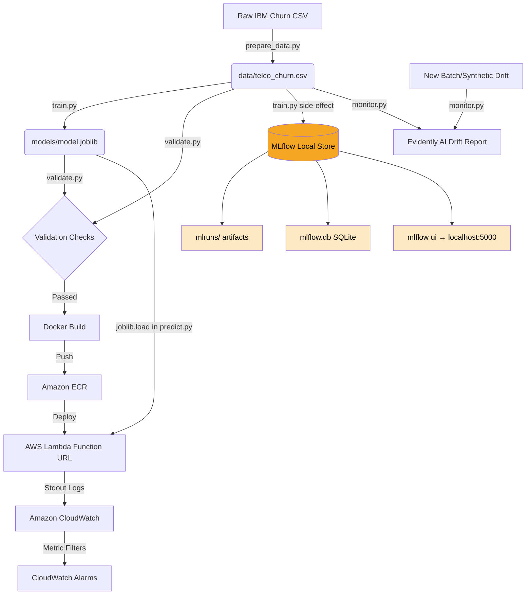

# Telco Customer Churn MLOps Pipeline

An end-to-end MLOps proof of concept (POC) demonstrating **CI/CD/CT/CM** for a binary classifier predicting customer churn on the **Telco Customer Churn dataset** (IBM).

---

## 🏗️ Architectural Overview



---

## 🛠️ Tech Stack

- **Data Versioning**: DVC (Data Version Control) with AWS S3 backend
- **Experiment Tracking**: MLflow (local file-based tracking)
- **CI/CD Orchestration**: GitHub Actions
- **Containerization**: Docker
- **Inference Hosting**: AWS Lambda (containerized function URL)
- **Continuous Monitoring**: Evidently AI + AWS CloudWatch

---

## 🚀 Getting Started

### 1. Installation & Environment Setup

Create a Python 3.11/3.12 virtual environment and install the required dependencies:

```bash
python -m venv .venv
.venv\Scripts\activate      # Windows
source .venv/bin/activate    # Linux/macOS

pip install -r requirements.txt
```

### 2. Version Control Initialization

Initialize DVC and hook up your S3 remote storage for tracking dataset and model artifacts:

```bash
# Initialize DVC
dvc init

# Add remote S3 bucket for tracking large artifacts
dvc remote add -d s3remote s3://mlops-poc-dvc-telco-churn/dvc-store
```

---

## 🔄 Running the Pipeline (DVC)

We use DVC to structure the ML lifecycle stages (`prepare` and `train`) and reproduce them efficiently.

```bash
# Run/reproduce the pipeline defined in dvc.yaml
dvc repro

# Push the outputs (data/telco_churn.csv & models/model.joblib) to remote S3 storage
dvc push

# Pull updated data/models in another workspace or runner
dvc pull
```

---

## 📊 Experiment Tracking (MLflow)

### Scope & Capacity

MLflow is integrated **locally only** — there is no remote tracking server, no Databricks/MLflow Cloud connection, and no MLflow-managed deployment. It operates purely as a local experiment journal during training.

| Capability | Status |
|---|---|
| Experiment tracking (params & metrics) | ✅ Active — runs on every `train.py` execution |
| Model artifact logging | ✅ Logged to `mlruns/` via `mlflow.sklearn.log_model()` |
| Local UI (`mlflow ui`) | ✅ Available for browsing runs at `localhost:5000` |
| Remote tracking server | ❌ Not configured |
| MLflow Model Registry | ❌ Not used — no staging/production promotion |
| MLflow model serving / deployment | ❌ Not used — `predict.py` loads the model via `joblib` directly |
| CI/CD integration | ❌ GitHub Actions does not start or query any MLflow server |

### What Gets Tracked (in `train.py`)

**Parameters logged per run:**
- `n_estimators`, `random_state`, `max_depth`, `test_size`

**Metrics logged per run:**
- `accuracy`, `precision`, `recall`, `f1_score`, `roc_auc`

**Artifacts logged per run:**
- The trained `RandomForestClassifier` via `mlflow.sklearn.log_model()`

### Local Storage

All run data is stored in two places at the project root:
- `mlruns/` — run artifacts, model files, metric history
- `mlflow.db` — SQLite database backing the tracking store

### How to Use Locally

After running `python src/train.py` (or `dvc repro`), launch the tracking UI:

```bash
mlflow ui
```

Then visit `http://127.0.0.1:5000` in your browser to:
- Browse all runs under the `Telco-Churn-Experiment` experiment
- Compare parameters and metrics across runs
- Download the logged model artifact from any run

> **Note:** The model used in production (Docker / AWS Lambda) is **not** loaded from MLflow. It is loaded from `models/model.joblib` via `joblib` in `predict.py`. MLflow's logged model copy is available for local inspection and reproducibility only.

---

## 🧪 Testing & Validation

Run unit tests and local schema validation:

```bash
# Run unit tests
pytest tests/ -v

# Run the validation checks
python src/validate.py
```

---

## 🐳 Containerization & Local Mocking

To package the inference API into a Lambda-compatible Docker container:

```bash
# Build the Docker image
docker build -t telco-churn-predictor .

# Run the container locally (mapped to Lambda port 8080)
docker run -p 9000:8080 telco-churn-predictor
```

Invoke the local endpoint using `curl`:

```bash
curl -X POST "http://localhost:9000/2015-03-31/functions/function/invocations" \
  -H "Content-Type: application/json" \
  -d '{"body": "{\"Contract\": 0, \"tenure\": 5, \"MonthlyCharges\": 70.35, \"TotalCharges\": 351.75, \"InternetService\": 1, \"PaymentMethod\": 2}"}'
```

---

## 📡 Continuous Monitoring (CM) & Drift Detection

Evidently AI is configured to verify feature drift by comparing current inference data against the baseline training dataset.

To run drift analysis on a synthetic batch (shifting `MonthlyCharges`, `tenure`, and `Contract`):

```bash
python src/monitor.py
```

This will output logs summarizing the drift results and generate an interactive dashboard at:
`reports/drift_report.html`

---

## ❓ FAQ

### What is a "training run" in MLflow?

A **run** is a single execution of `train.py` — one attempt to train the model with a specific set of settings, recorded as a timestamped snapshot. Think of it like a lab notebook entry: *"On this date, I tried these settings and got these results."*

In this pipeline, one run = one `with mlflow.start_run():` block. Each run records:
- **What you tried** (params): `n_estimators`, `max_depth`, `random_state`, `test_size`
- **What you got** (metrics): `accuracy`, `precision`, `recall`, `f1_score`, `roc_auc`
- **The trained model** (artifact): a copy of the `RandomForestClassifier` saved to `mlruns/`

**Example with the Telco Churn dataset** — three runs, each with different hyperparameters:

| Run | `n_estimators` | `max_depth` | `accuracy` | `roc_auc` | `f1_score` |
|---|---|---|---|---|---|
| Run 1 | 100 | None (unlimited) | 0.8012 | 0.8431 | 0.5873 |
| Run 2 | 200 | 10 | 0.8134 | 0.8560 | 0.6021 ✅ best |
| Run 3 | 50 | 5 | 0.7890 | 0.8210 | 0.5640 |

The experiment (`Telco-Churn-Experiment`) is the umbrella that groups all runs. You compare them in `mlflow ui` and pick the best one. Note that the model promoted to production is manually copied to `models/model.joblib` — MLflow does not automate this step in this pipeline.

---

### Does MLflow log a new run even if hyperparameters haven't changed?

**Yes.** MLflow logs a new run every time `train.py` executes, regardless of whether anything changed. The trigger is simply entering the `with mlflow.start_run():` block — MLflow has no awareness of previous runs.

Running `python src/train.py` five times without changes produces five identical runs:

```
Telco-Churn-Experiment
├── Run 1  (13:00)  n_estimators=100, max_depth=None → accuracy=0.8012
├── Run 2  (13:05)  n_estimators=100, max_depth=None → accuracy=0.8012  ← duplicate
├── Run 3  (13:10)  n_estimators=100, max_depth=None → accuracy=0.8012  ← duplicate
├── Run 4  (13:15)  n_estimators=100, max_depth=None → accuracy=0.8012  ← duplicate
└── Run 5  (13:20)  n_estimators=100, max_depth=None → accuracy=0.8012  ← duplicate
```

This is expected behaviour in a **CT (Continuous Training)** context. Even with fixed hyperparameters, retraining on **new or updated data** will produce different metrics — and MLflow captures that shift across runs automatically.

> **Tip:** If `mlruns/` grows large over time from redundant model artifacts, prune old runs with `mlflow gc`.

---

### How is model/data drift handled?

Drift detection is handled by **Evidently AI** in [`monitor.py`](src/monitor.py). MLflow plays no role here.

#### Data Drift ✅ Detected

`monitor.py` compares **input feature distributions** between a reference dataset (`data/telco_churn.csv`) and a current batch. It uses Evidently's `DataDriftPreset`, which runs a statistical test (KS test, chi-squared, etc.) per feature and flags significant shifts.

**Example with the Telco Churn features:**

| Feature | Reference | Current (synthetic drift injected) | Status |
|---|---|---|---|
| `MonthlyCharges` | ~$65 avg | ~$100 avg (+$35 shift) | 🔴 DRIFTED |
| `tenure` | ~32 months | ~20 months (−12 shift) | 🔴 DRIFTED |
| `Contract` | balanced distribution | skewed to month-to-month (70%) | 🔴 DRIFTED |
| `gender`, `Partner`, etc. | unchanged | unchanged | 🟢 STABLE |

If more than 50% of features drift, Evidently flags **dataset-level drift** and `monitor.py` exits with code `2`.

#### Model/Performance Drift ❌ Not Handled

There is no model performance monitoring in this pipeline:
- `monitor.py` only checks **input features**, not whether predictions are deteriorating
- There is no ground-truth label comparison (e.g. "we predicted no churn but the customer actually churned")
- No `PredictionDriftPreset` or `ClassificationPreset` from Evidently is used

This is a known gap in the POC — real model drift detection requires collecting actual post-inference outcomes.

#### Auto-Retraining on Drift ❌ Not Wired

The CT pipeline (GitHub Actions) only triggers on a **git push to `main`** — not on a drift event. Drift detection and retraining are currently disconnected. Bridging them (e.g. drift → open a PR or trigger a workflow dispatch) is the natural next evolution of this pipeline.

**Summary:**

| Concern | Status |
|---|---|
| Data (feature) drift detection | ✅ Evidently `DataDriftPreset` |
| Model performance drift | ❌ Not monitored |
| Automatic retraining on drift | ❌ Not wired |
| CloudWatch monitoring | ⚠️ Lambda runtime errors only — not ML-specific |
