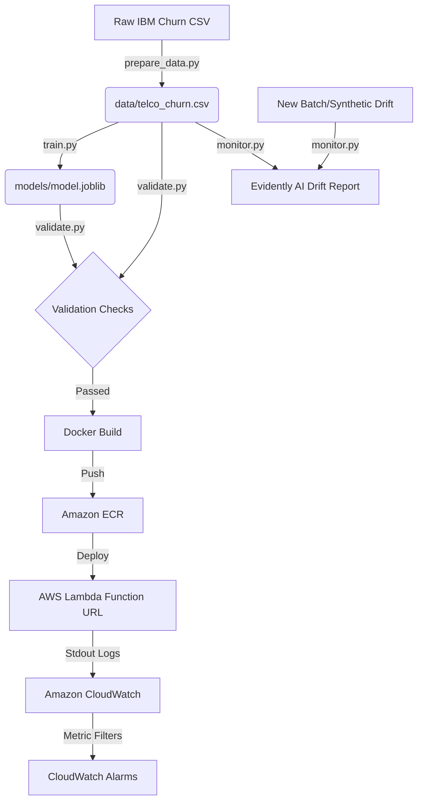

# Telco Customer Churn MLOps Pipeline

An end-to-end MLOps proof of concept (POC) demonstrating **CI/CD/CT/CM** for a binary classifier predicting customer churn on the **Telco Customer Churn dataset** (IBM).

---

## 🏗️ Architectural Overview



---

## 🛠️ Tech Stack

- **Data Versioning**: DVC (Data Version Control) with AWS S3 backend
- **Experiment Tracking**: MLflow (local file-based tracking)
- **CI/CD Orchestration**: GitHub Actions
- **Containerization**: Docker
- **Inference Hosting**: AWS Lambda (containerized function URL)
- **Continuous Monitoring**: Evidently AI + AWS CloudWatch

---

## 🚀 Getting Started

### 1. Installation & Environment Setup

Create a Python 3.11/3.12 virtual environment and install the required dependencies:

```bash
python -m venv .venv
.venv\Scripts\activate      # Windows
source .venv/bin/activate    # Linux/macOS

pip install -r requirements.txt
```

### 2. Version Control Initialization

Initialize DVC and hook up your S3 remote storage for tracking dataset and model artifacts:

```bash
# Initialize DVC
dvc init

# Add remote S3 bucket for tracking large artifacts
dvc remote add -d s3remote s3://mlops-poc-dvc-telco-churn/dvc-store
```

---

## 🔄 Running the Pipeline (DVC)

We use DVC to structure the ML lifecycle stages (`prepare` and `train`) and reproduce them efficiently.

```bash
# Run/reproduce the pipeline defined in dvc.yaml
dvc repro

# Push the outputs (data/telco_churn.csv & models/model.joblib) to remote S3 storage
dvc push

# Pull updated data/models in another workspace or runner
dvc pull
```

---

## 📊 Experiment Tracking (MLflow)

All training metrics (accuracy, precision, recall, f1, ROC-AUC) and parameters are tracked automatically. To run the MLflow UI dashboard locally:

```bash
mlflow ui
```
Then visit `http://127.0.0.1:5000` in your browser.

---

## 🧪 Testing & Validation

Run unit tests and local schema validation:

```bash
# Run unit tests
pytest tests/ -v

# Run the validation checks
python src/validate.py
```

---

## 🐳 Containerization & Local Mocking

To package the inference API into a Lambda-compatible Docker container:

```bash
# Build the Docker image
docker build -t telco-churn-predictor .

# Run the container locally (mapped to Lambda port 8080)
docker run -p 9000:8080 telco-churn-predictor
```

Invoke the local endpoint using `curl`:

```bash
curl -X POST "http://localhost:9000/2015-03-31/functions/function/invocations" \
  -H "Content-Type: application/json" \
  -d '{"body": "{\"Contract\": 0, \"tenure\": 5, \"MonthlyCharges\": 70.35, \"TotalCharges\": 351.75, \"InternetService\": 1, \"PaymentMethod\": 2}"}'
```

---

## 📡 Continuous Monitoring (CM) & Drift Detection

Evidently AI is configured to verify feature drift by comparing current inference data against the baseline training dataset.

To run drift analysis on a synthetic batch (shifting `MonthlyCharges`, `tenure`, and `Contract`):

```bash
python src/monitor.py
```

This will output logs summarizing the drift results and generate an interactive dashboard at:
`reports/drift_report.html`
