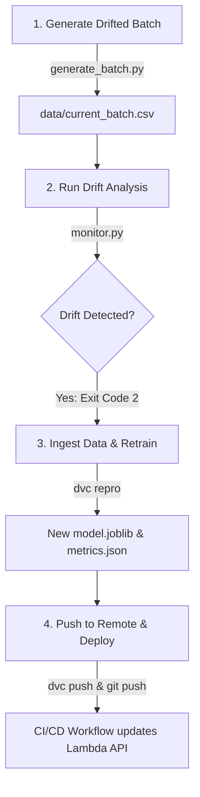

# MLOps Drift & Retrain Loop (CM/CT/CD)

This guide documents the end-to-end MLOps loop, explaining how data drift is detected, how the retraining pipeline is triggered, and how the updated model is deployed to production.

---

## The End-to-End MLOps Lifecycle

The following diagram illustrates how the continuous monitoring (CM), continuous training (CT), and continuous deployment (CD) workflows interact in our pipeline:



---

## 1. Continuous Monitoring (CM) — Detection
Live incoming traffic features are periodically batched (e.g. daily or weekly). We run the monitoring script using **Evidently AI** against this batch:

```powershell
python src/monitor.py data/current_batch.csv
```

* **Drift Threshold**: Evidently runs statistical tests comparing the current batch against the reference baseline (`data/telco_churn.csv`).
* **Trigger Status**: If dataset-level drift exceeds the threshold, `monitor.py` returns **exit code 2**. In a production environment, this exit code triggers alerts or initiates the retraining pipeline automatically.

---

## 2. Continuous Training (CT) — Ingestion & Retraining
When a drift alarm fires, the new production batch data is ingested and merged with the historical training dataset.

Since **DVC** tracks our training dataset, it immediately detects that the data file has changed:

```powershell
# Run the DVC pipeline to retrain the model
dvc repro
```

* **Pipeline Execution**: DVC checks the hash of `data/telco_churn.csv`, notes the mismatch, and re-executes the data preparation (`prepare_data.py`) and training (`train.py`) stages automatically.
* **Outputs**: DVC outputs a new `models/model.joblib` and `metrics.json`, and records their new hashes in `dvc.lock`.

---

## 3. Continuous Deployment (CD) — Redeployment
To deploy the newly trained model, we push the updated metadata and files to our remote stores:

```powershell
# Upload new model binary to S3 DVC store
dvc push

# Push updated hashes to Git
git add dvc.lock
git commit -m "Retrained model due to data drift"
git push origin master
```

* **Automated Action**: The Git push to `master` triggers the **CT/CD - Train & Deploy** GitHub Actions workflow.
* **Container Push**: The workflow rebuilds the Docker container with the new `model.joblib` and pushes it to Amazon ECR.
* **Serverless Update**: The workflow calls `aws lambda update-function-code` to update the Lambda endpoint, making the retrained model live immediately.
