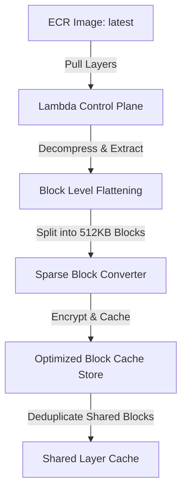
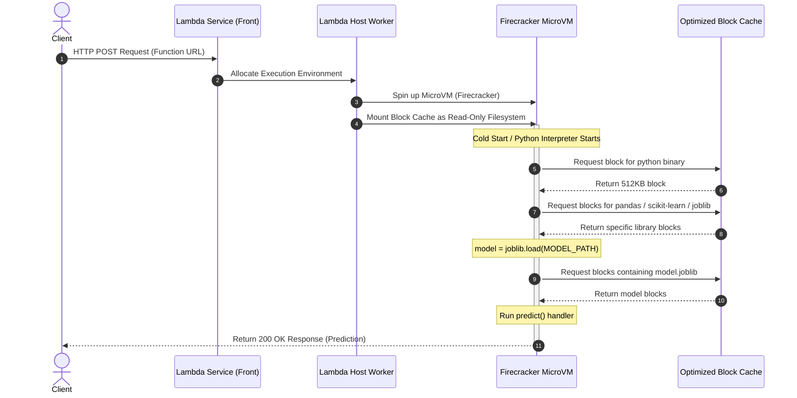

# AWS Lambda Container Loading: Under the Hood

This document explains the internal mechanisms AWS Lambda uses to pull, optimize, mount, and execute container images hosted in Amazon Elastic Container Registry (ECR).

---

## 1. Deployment Time: Optimization & Chunking

When a container image is deployed to AWS Lambda (via `create-function` or `update-function-code`), Lambda optimizes the image layers to enable rapid startup times.

### Steps:
1. **Control Plane Pull**: The Lambda service pulls the requested image layers from ECR using standard registry APIs.
2. **Flattening**: The compressed image layers are flattened into a single filesystem representation.
3. **Block Chunking**: The flattened filesystem is broken down into small, encrypted, fixed-size chunks (typically **512 KB blocks**).
4. **Optimized Cache Storage**: These chunks are stored in an internal, highly available block store close to the Lambda execution hosts.
5. **Deduplication**: If multiple Lambda functions or function versions share identical base layers (e.g. standard Python runtime layers), those blocks are shared in the block store cache, avoiding redundant storage.

---

## 2. Invocation Time: Sparse Loading & On-Demand Execution

When a function is invoked (causing a cold start), Lambda boots the environment and mounts the cached block store using a **read-on-demand** mechanism.

### Detailed Mechanics:
1. **Firecracker MicroVM Boot**: When an invocation request is received and no warm execution environment is active, the Lambda worker host boots a lightweight **Firecracker MicroVM** in under 150 milliseconds.
2. **Virtual Network Mount**: The MicroVM mounts the cached blocks (generated in the deployment phase) as a virtual, read-only block device. The complete image is **never downloaded** to the host.
3. **Sparse Loading**:
   * As the Python runtime starts and executes imports (e.g., `import pandas`, `import sklearn`), the kernel triggers page faults on the block device.
   * The filesystem driver fetches **only the specific 512KB blocks** containing those requested files over the internal network.
   * If a block is never accessed (e.g., unused shell utilities, compilers, or alternative libraries), it is never downloaded, saving network bandwidth and startup latency.
4. **Local Block Caching**: Once loaded, blocks are cached locally in the MicroVM's memory. Subsequent calls (warm starts) bypass the network mount entirely, returning predictions in milliseconds.

---

## 3. How to Optimize Container Startup Performance

Knowing the internal architecture allows us to make deliberate optimization choices:

| Optimization Strategy | How it works under the hood | MLOps Implementation |
| :--- | :--- | :--- |
| **Increase Memory Allocation** | AWS Lambda allocates CPU resources proportionally to memory. Increasing memory size increases the MicroVM's CPU allocation. | Upgraded the Lambda function from **512 MB to 1024 MB** (allocates a full vCPU), cutting package import and block initialization times in half. |
| **Remove Cold-Start Blocks** | Module-level code runs during the strict 10-second initialization window. Moving operations to the handler shifts them to the 30-second invocation window. | Moved the heavy model-loading step (`joblib.load`) from the global module scope to be **lazy-loaded inside the handler** in `predict.py`. |
| **Minimize Dependency Footprint** | Fewer files to load means fewer 512KB block network calls during the import process. | Created a clean **`requirements-predict.txt`** containing only the packages necessary for inference (removing `mlflow`, `dvc`, and dev dependencies), which keeps the ECR image small and fast. |
