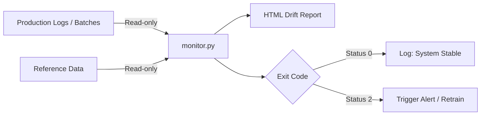
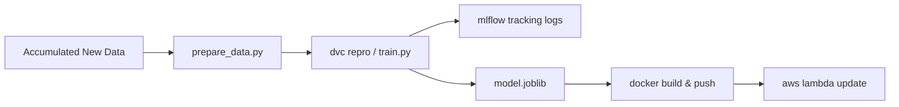

# Differentiating the Monitoring Loop (CM) vs. Retraining Loop (CT)

In a mature MLOps system, **Continuous Monitoring (CM)** and **Continuous Training (CT)** are two distinct, independent loops that work together to keep the machine learning model accurate, stable, and secure.

---

## Dueling Loops: Quick Comparison

| Characteristic | Detections & Monitoring (CM) | Ingestion & Retraining (CT/CD) |
| :--- | :--- | :--- |
| **System Phase** | Continuous Monitoring | Continuous Training & Deployment |
| **Action Role** | **The Observer (Sensor)** | **The Actor (Updater)** |
| **Triggered By** | Scheduled Cron (daily/weekly) | Code/Data Push, or Triggered Alarm |
| **Primary Inputs** | Production logs + Baseline training dataset | Accumulated drifted data + Baseline data |
| **Execution Tool** | **Evidently AI** | **DVC + MLflow + scikit-learn** |
| **Primary Outputs** | Interactive HTML Drift Reports, alerts | Pushed DVC hashes, updated ECR/Lambda |
| **Effect on Production** | **None** (Read-only observation) | **High** (Updates live prediction model) |

---

## 1. The Monitoring Loop (Continuous Monitoring — CM)
The monitoring loop acts as a **sensor** on top of your production API. It doesn't modify the running system; its only goal is to audit inputs and warn the engineering team if the real world is starting to drift away from what the model expects.

### Key Details:
* **Trigger Mechanism**: Runs on a schedule (e.g., daily at 06:00 UTC via `.github/workflows/monitor.yml`).
* **Input Data**: It compares the baseline reference data (`data/telco_churn.csv`) against a batch of newly collected production logs (`data/current_batch.csv`).
* **Data Flow**: It operates as a read-only pipeline. It compiles statistical checks (Wasserstein distance for numbers, Jensen-Shannon for categories) to see if columns have drifted.
* **Alerting**: If dataset-level drift is detected, it exits with **Exit Code 2**, which triggers alerts (Slack notifications, emails via SNS) to signal that the model needs retraining.

---

## 2. The Retraining & Deployment Loop (Continuous Training — CT/CD)
The retraining loop is the **actor**. Once an alarm is raised (or code/data updates are pushed), it takes the accumulated training data, validates it, trains a fresh model version, and deploys it to the serving endpoint.

### Key Details:
* **Trigger Mechanism**: Triggered by a push to the `master` branch (or via manual pipeline execution in `.github/workflows/train-deploy.yml`).
* **Input Data**: Merged training dataset containing historical records and the newly accumulated production batches.
* **Process**:
  1. Runs preprocessing (`prepare_data.py`).
  2. Runs model training (`train.py`) and tracks performance in **MLflow** to ensure the retrained model does not degrade.
  3. Verifies model schema and accuracy thresholds (`validate.py`).
  4. Packaging and deploying the new binary to AWS ECR and Lambda.
* **Impact**: Updates the live endpoint, altering the prediction outputs served to users.

---

## How the Two Loops Interact (The Lifecycle)

Although they are independent, the two loops form a feedback loop over time:

1. **Drift Occurs**: Live customer behaviors shift (e.g. higher bills, month-to-month contracts).
2. **CM Detects it**: The daily `monitor.yml` cron checks the logs, flags the shift, and generates a **Drift Report** showing 3 drifted columns. The job alerts the team.
3. **Data Ingestion**: The team appends the drifted batch data to the training baseline.
4. **CT Retrains**: The DVC pipeline runs `dvc repro` to retrain the model on the updated baseline and pushes it to AWS.
5. **Baseline Reset**: The reference baseline (`data/telco_churn.csv`) now contains the new customer behaviors.
6. **CM Reports Stable**: The next time `monitor.yml` runs, it compares the incoming logs against the *updated* baseline. Since they now match, **drift is no longer detected**, and the alarm goes silent.
